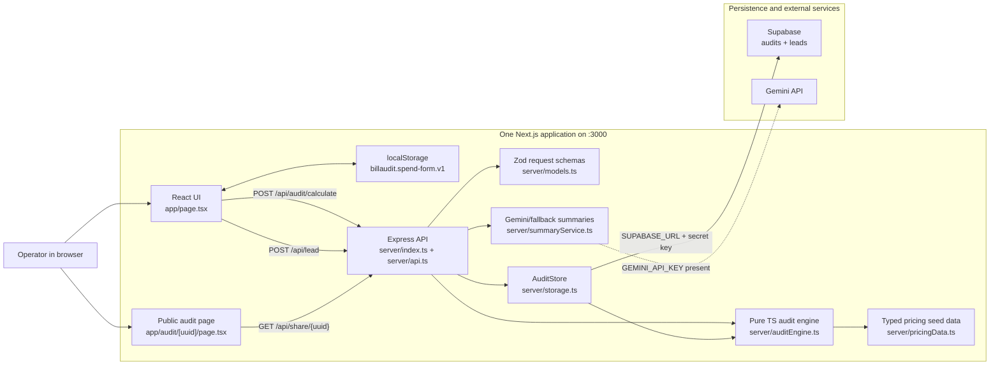

# BillAudit architecture

BillAudit is a full-stack Next.js application. Next renders the React frontend pages, and a custom Express server mounted in the same app serves backend API routes under `/api/*` on the same port.

## System diagram

## Data flow

1. The user opens `/`, which is rendered by Next and React from `app/page.tsx`.
2. Spend inputs are autosaved in browser `localStorage` under `billaudit.spend-form.v1`.
3. Clicking “Run spend audit” sends `POST /api/audit/calculate` to the Express router on the same server.
4. Zod validates the audit request: 1-20 tools, unique `tool_id`, team size bounds, billing cycle, non-negative spend, and maximum monthly spend.
5. `server/auditEngine.ts` computes normalized monthly spend, tier matching, recommended plan, savings, annual totals, savings percentage, and fallback summary.
6. `server/summaryService.ts` uses Gemini only when `GEMINI_API_KEY` or `GOOGLE_API_KEY` exists; otherwise it returns the deterministic fallback summary.
7. `server/storage.ts` upserts the audit to Supabase `audits`. Missing Supabase configuration is a server configuration error.
8. Lead capture sends `POST /api/lead`; the lead is inserted into Supabase `leads`.
9. Public audit pages render at `/audit/:uuid`; the server page fetches `GET /api/share/:uuid`, which strips PII and returns aggregate audit data only.

## Stack justification

- **Next.js + React**: keeps the UI, public share route, metadata, and Open Graph rendering in one App Router project.
- **Express inside the Next server**: gives explicit backend route control without running a separate backend port or Python service.
- **TypeScript + Zod**: replaces Pydantic with compile-time types plus runtime validation for untrusted JSON.
- **Decimal.js**: keeps financial math deterministic and avoids ordinary JavaScript floating-point surprises.
- **Supabase**: required database provider for durable audits and leads.
- **Gemini API**: enables optional executive summaries without making LLM availability a hard dependency. Gemini is the only LLM provider used by the backend.

## API surface

- `GET /api/health` - service health.
- `GET /api/tools` - supported tools and tier names/prices.
- `POST /api/audit/calculate` - validated audit request, audit result response.
- `GET /api/audit/:auditId` - saved full audit result.
- `GET /api/share/:auditId` - PII-safe public audit view.
- `POST /api/lead` - lead capture.

## Supabase database

The required tables are documented in `docs/SUPABASE_SCHEMA.md`. `audits.audit_id` is the durable UUID used by `/audit/:uuid`; `audits.payload` stores the full typed audit result, while `leads.audit_id` links captured leads back to the audit.

## Scalability plan for 10k audits/day

10k audits/day is roughly 7 audits/minute on average, with higher bursts during demos or campaigns. The current app can handle that in a small deployment if Supabase is configured, but these changes would harden it:

1. **Persist every audit in Supabase** and keep service-role credentials server-only.
2. **Add indexes** on `audits.audit_id`, `audits.created_at`, and `leads.audit_id`.
3. **Move Gemini summaries to a queue** if p95 latency or rate limits become a problem; return fallback immediately and update `ai_summary` asynchronously.
4. **Cache `/api/tools`** because pricing seed data is static during a deployment.
5. **Add rate limiting** for `/api/audit/calculate` and `/api/lead` by IP/session to protect spend and prevent spam.
6. **Add structured logs and metrics** for audit count, validation failures, Supabase errors, and LLM fallback rate.
7. **Run multiple app instances** behind the hosting provider’s load balancer; Supabase is the shared persistence layer across instances.
