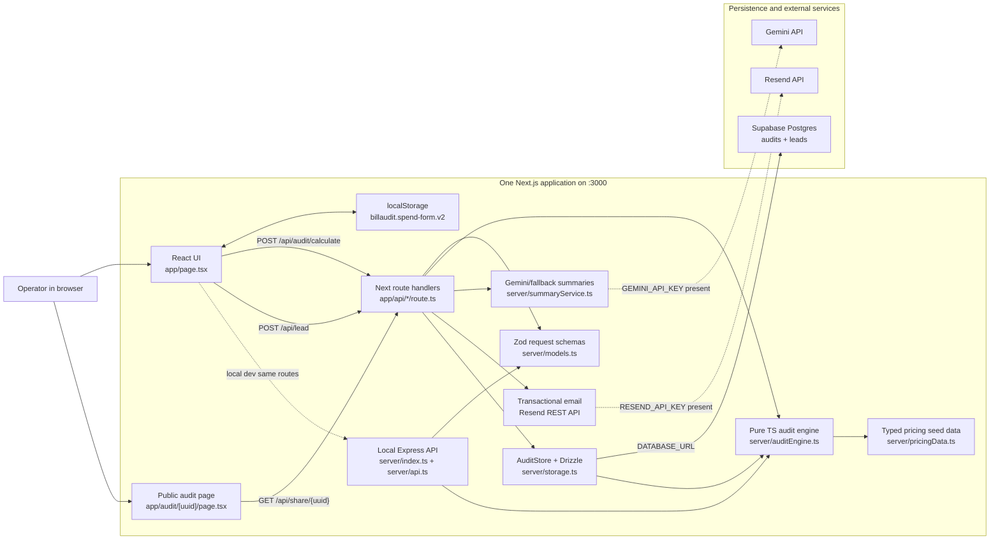

# BillAudit architecture

BillAudit is a full-stack Next.js application. Next renders the React frontend pages and, on Vercel, native App Router route handlers serve backend API routes under `/api/*`. Local development still uses a custom Express server on the same port, but the business logic is shared through `server/` modules so the API contract stays identical.

## System diagram

## Data flow

1. The user opens `/`, which is rendered by Next and React from `app/page.tsx`.
2. Spend inputs are autosaved in browser `localStorage` under `billaudit.spend-form.v2`, with legacy `v1` drafts normalized into the current tool list.
3. Clicking “Run spend audit” sends `POST /api/audit/calculate` as a same-origin request. Vercel handles it through `app/api/audit/calculate/route.ts`; local dev can handle the same route through Express.
4. Zod validates the audit request: 1-20 tools, unique `tool_id`, team size bounds, billing cycle, non-negative spend, and maximum monthly spend.
5. `server/auditEngine.ts` computes normalized monthly spend, tier matching, recommended plan, savings, annual totals, savings percentage, and fallback summary.
6. `server/summaryService.ts` uses Gemini only when `GEMINI_API_KEY` or `GOOGLE_API_KEY` exists; otherwise it returns the deterministic fallback summary.
7. `server/storage.ts` uses Drizzle ORM to upsert the audit to the Postgres `audits` table. Missing `DATABASE_URL` is a server configuration error.
8. Lead capture sends `POST /api/lead`; honeypot and IP rate-limit checks run first, Gemini writes a short internal lead brief, the lead is inserted into Postgres through Drizzle, and Resend sends a confirmation email to the user-entered address when `RESEND_API_KEY` and a verified `EMAIL_FROM` are configured.
9. Capturing the report unlocks the public `/audit/:uuid` share URL in the UI. High-savings cases also expose a Credex consultation CTA powered by `NEXT_PUBLIC_CREDEX_BOOKING_URL` when configured.
10. Public audit pages render at `/audit/:uuid`; the server page fetches `GET /api/share/:uuid`, which strips PII and returns tool-level savings data only.

## Stack justification

- **Next.js + React**: keeps the UI, public share route, metadata, and Open Graph rendering in one App Router project.
- **Native Next route handlers plus local Express**: route handlers make Vercel deployment work without a custom Node server, while Express keeps the same local one-port workflow.
- **TypeScript + Zod**: replaces Pydantic with compile-time types plus runtime validation for untrusted JSON.
- **Decimal.js**: keeps financial math deterministic and avoids ordinary JavaScript floating-point surprises.
- **Drizzle + Supabase Postgres**: Drizzle provides typed persistence while Supabase Postgres provides the hosted database.
- **Gemini API**: enables optional executive summaries without making LLM availability a hard dependency. Gemini is the only LLM provider used by the backend.
- **Resend REST API**: sends transactional audit confirmations with a simple server-side fetch call and no frontend exposure of email credentials.

## API surface

- `GET /api/health` - service health.
- `GET /api/tools` - supported tools and tier names/prices.
- `POST /api/audit/calculate` - validated audit request, audit result response.
- `GET /api/audit/:auditId` - saved full audit result.
- `GET /api/share/:auditId` - PII-safe public audit view.
- `POST /api/lead` - lead capture.

## Database

The required tables are defined in `server/db/schema.ts` and documented in `docs/SUPABASE_SCHEMA.md`. `audits.audit_id` is the durable UUID used by `/audit/:uuid`; `audits.payload` stores the full typed audit result, while `leads.audit_id` links captured leads back to the audit.

## Abuse protection and email

Lead capture uses a hidden honeypot field plus an in-memory IP rate limit of 5 lead submissions per hour. This is intentionally lightweight for an MVP because it blocks common bot form fills without adding hCaptcha friction before the user receives value. Transactional email uses Resend via `RESEND_API_KEY` and requires `EMAIL_FROM`; high-savings cases explicitly say Credex will reach out and show the consultation CTA.

## Scalability plan for 10k audits/day

10k audits/day is roughly 7 audits/minute on average, with higher bursts during demos or campaigns. The current app can handle that in a small deployment if Supabase is configured, but these changes would harden it:

1. **Persist every audit through Drizzle** and keep `DATABASE_URL` server-only.
2. **Add indexes** on `audits.audit_id`, `audits.created_at`, and `leads.audit_id`.
3. **Move Gemini summaries to a queue** if p95 latency or rate limits become a problem; return fallback immediately and update `ai_summary` asynchronously.
4. **Cache `/api/tools`** because pricing seed data is static during a deployment.
5. **Add rate limiting** for `/api/audit/calculate` and `/api/lead` by IP/session to protect spend and prevent spam.
6. **Add structured logs and metrics** for audit count, validation failures, Supabase errors, and LLM fallback rate.
7. **Run multiple app instances** behind the hosting provider’s load balancer; Supabase Postgres is the shared persistence layer across instances.
